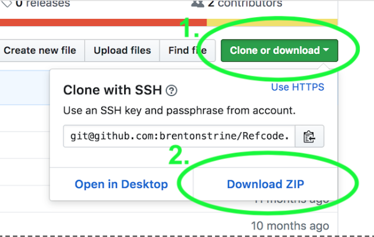

# Downloading the Refcode Repositiory from Github

1. Go to the [GitHub Refcode repository](https://github.com/brentonstrine/Refcode)
1. On that page, click “Clone or Download” and then “Download ZIP”.     This will download the Refcode repository as a .zip file.   **Hint**: *Where did you download it to?*
1. Decompress it somewhere.   **Hint**: *Where did you decompress it?*
1. Open Atom and add the Refcode folder as a project. 
1. In Atom, open the following file: `Refcode/Sprint-01/homework/helloworld.html`

## Exercise
In the file above (helloworld.html) do the following:
- [ ] HTML: Try to write a new HTML tag for a level 2 heading
- [ ] CSS: Try to make the h1 tag red instead of the b tag
- [ ] Javascript: Try to make the page alert 555 instead of 45
