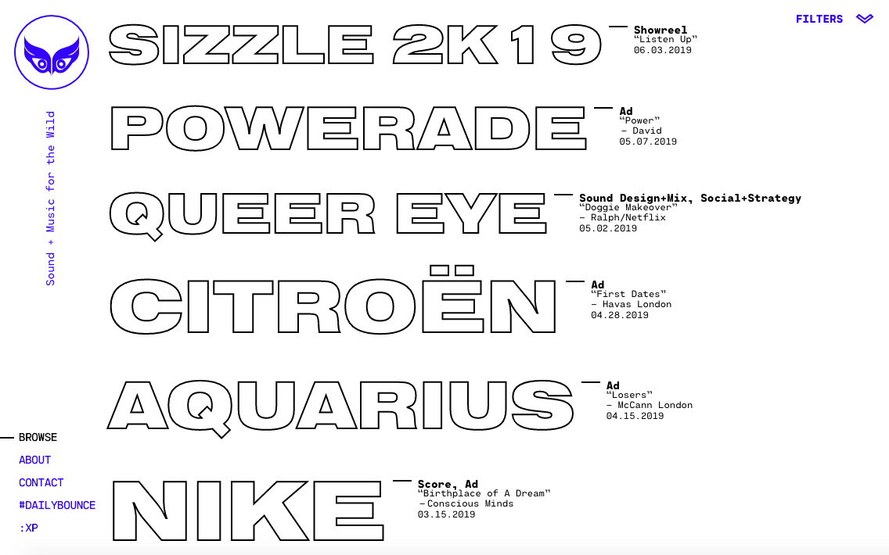
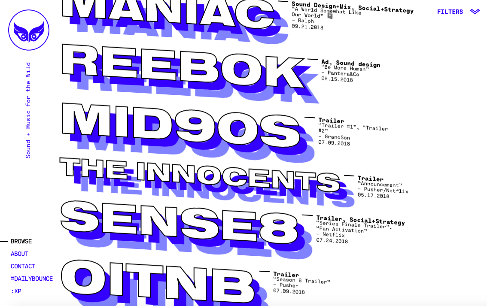
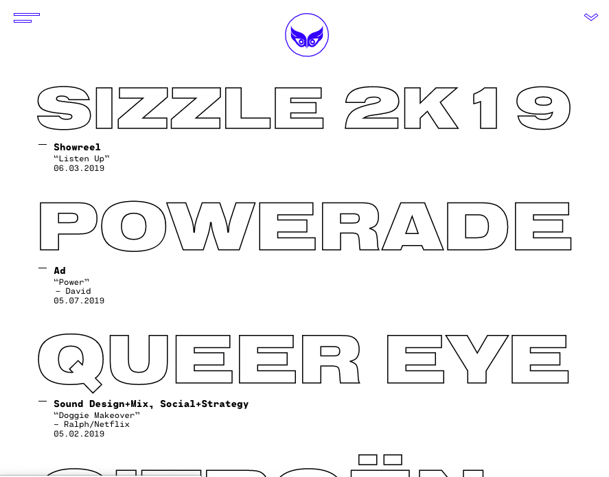
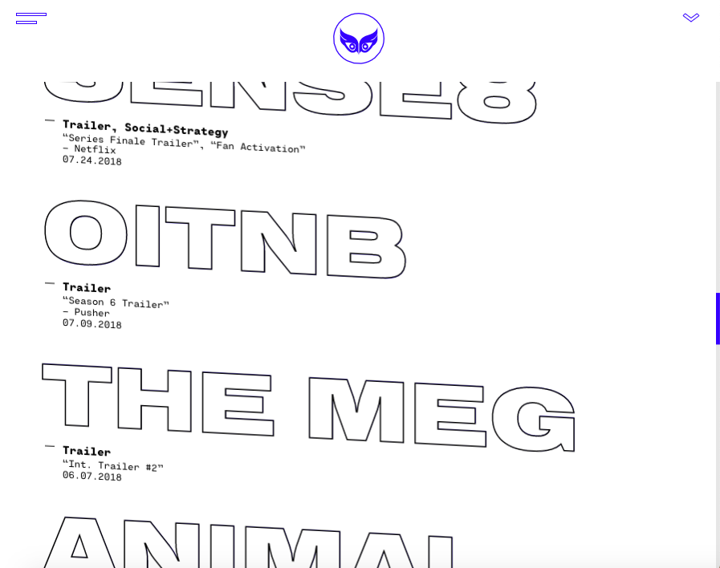
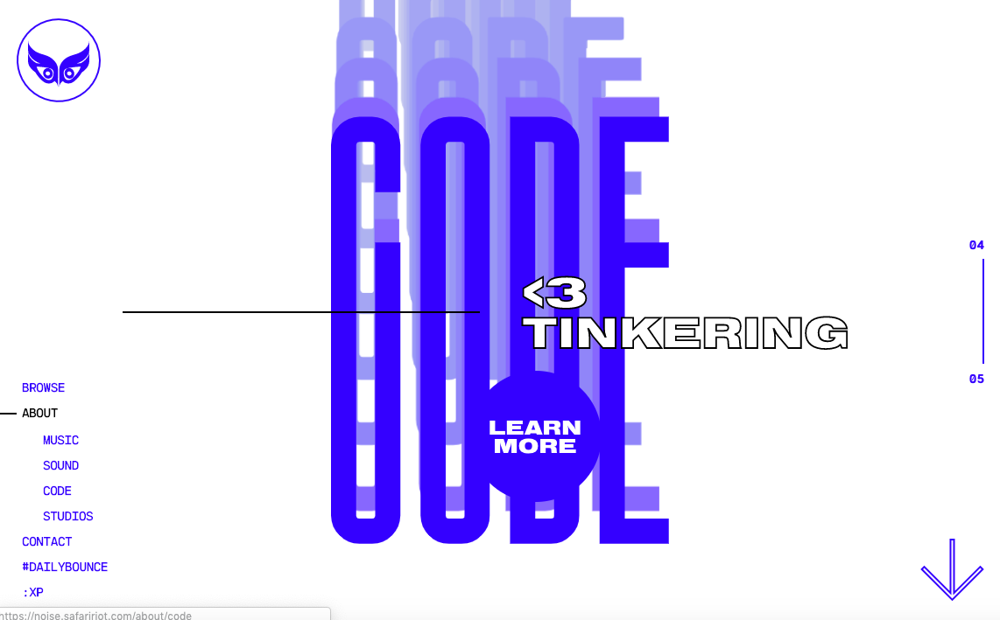

# Finding Inspiration Workshop
When looking for things to build, we briefly touched on looking at other sites for ideas. It’s good practice to look at what others have built and try to figure out how they made it. This exercise helps us learn new things and find different ways to make cool things. More importantly, it’s a way to explore and discover what is possible on the web. Even if we can’t make it look exactly like the source, we will be able to learn something new. 

## Awwwards
[Awwwards](https://www.awwwards.com) is a site that showcases exciting sites from around the world, and it's an excellent place to get some inspiration. 

There are a lot of sites out there that are using technology that may be unfamiliar to you. That's OK! Although websites might use extensive amounts of scripts and styles, they are still websites that we can inspect and view the basic structure. Remember, all websites are using HTML and CSS, so we should be able to understand at least a little bit of even the most extreme website. 

*What are some other sites we can use to find inspiration?*

## Exercise
Let’s try to recreate some parts of one of the sites [featured on Awwwards](https://www.awwwards.com/sites/safari-riot-noise) - [noise.safaririot.com](https://noise.safaririot.com).

There is a lot going on with the Safari Riot site. Let's break down what we know and where we can see we have gaps in our understanding. 

There are a few questions to ask when looking at the following pages
1. How is this page structured? 
1. What is the interaction being performed?
1. Based on what I know now, what could I do?

*Static Homepage on large screens*

*Scrolling Homepage on large screens*

*Static Homepage on smaller screens*

*Scrolling Homepage on smaller screens*

*About Page - Code*

[https://noise.safaririot.com/about#code](https://noise.safaririot.com/about#code)

### Steps
1. Create a new folder in your project repository called `projects`
1. In this folder, create another folder called `sprint-07`
1. Create a new html file called `index.html`
1. Here we are going to try to recreate some parts of the Safari Riot page. *What does the basic structure look like?*