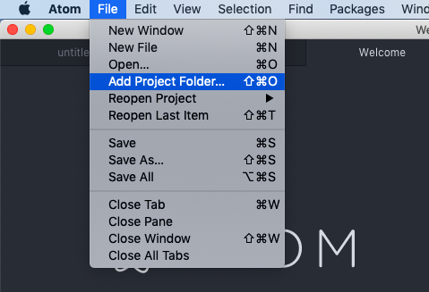
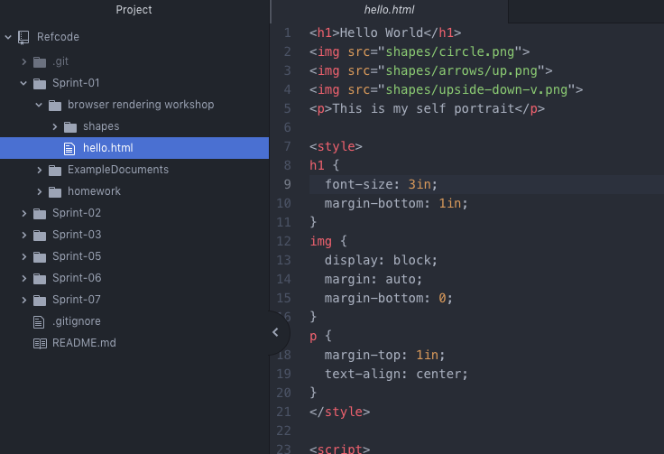

# Getting started with Atom

A text editor is at the core of a developer’s toolbox. Atom is a powerful text editor used by a large number of developers across multiple deciplines. Due to its popularity and ease of use, Atom is our perferred text editor for this course. 

## Downloading Atom 
To dowload Atom, go to [https://atom.io/](https://atom.io/) and click the Download button.

Once downloaded, open installer and follow instructions for your specific platform. 

## Opening Project in Atom
After installation, open Atom. We are now going to open our project folder in Atom. To do so, located the File menu item at the top left of the window. Next, select the *Add Project Folder* option from the File dropdown. From the file manager, select the top-level folder for the project and click the Open button. The project's file directory should now be visible in the pane on the left side of the editor in Atom. 

Clicking on a file in the side pane will open it in the editor.  

