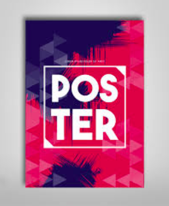
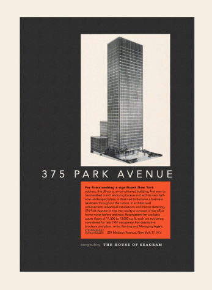
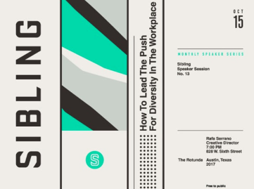
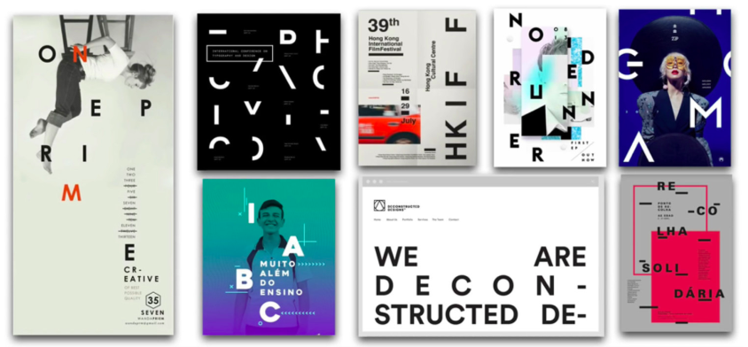

# Using CSS Grid to make beautiful websites 
CSS Grid the most powerful way to develop layouts on the web. By default, we are restricted to only laying out objects in one dimension. With CSS Grid, we can place elements in 2 dimensions. 

## Let's look at some print design

## Now let's look at how we could make this on the web
* [Big center content](https://glover.io/refcode-class/posters/01-poster.html)
* [Overlapping Elements](https://codepen.io/kevinglover/full/rKOLrE)
* [Horizontal Text](https://codepen.io/kevinglover/full/oyXZdy)
* [Dynamic Designs](https://codepen.io/kevinglover/full/NzqgwB)
* [Building around white space](https://labs.jensimmons.com/2019/01-001.html)
* [Deconstructed Design](https://labs.jensimmons.com/2019/01-006.html)

## CSS Grid Resources
* [https://www.w3schools.com/css/css_grid.asp](https://www.w3schools.com/css/css_grid.asp)
* [https://css-tricks.com/snippets/css/complete-guide-grid/](https://css-tricks.com/snippets/css/complete-guide-grid/)