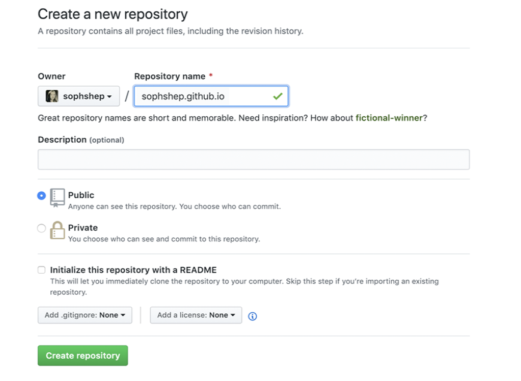
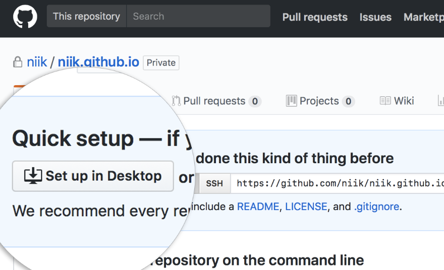

# Using Github Pages
Github pages is a way to host your website directly from your GitHub repository. We can use this method to quickly host websites because we don't need to setup and maintain our own servers.

## Setting up Github Pages
1. Head over to GitHub and create a new repository named username.github.io, where `username` is your username on GitHub.

2. Clone the repository to your local machine. Click the "Set up in Desktop" button. When the GitHub desktop app opens, save the project.

3. Open your project in Atom.
4. Create an `index.html` file to add to your project. We will use the base HTML structure found in [Structuring HTML Pages](../modules/structuring-html-pages)
5. Commit and Push. Enter the repository, commit your changes, and press the publish button.
 

 

6. Done! Open Chrome and go to `https://username.github.io`
> Note: Don't worry too much about the url address right now. We can update it to a custom domain later.
